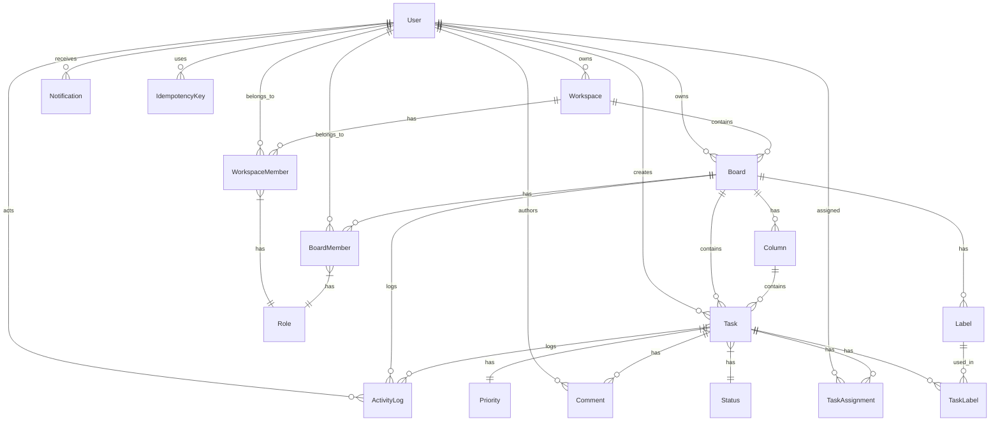

# Database Design

## Schema Overview



## Indexing Strategy

### Task Table (Highest Query Volume)

```sql
-- Primary access patterns
CREATE INDEX idx_task_board_id ON Task(boardId);
CREATE INDEX idx_task_column_position ON Task(columnId, position);
CREATE INDEX idx_task_due_date ON Task(dueDate) WHERE dueDate IS NOT NULL;

-- Composite for board load with ordering
-- (covered by columnId + position for kanban view)
```

**Rationale:**
- `boardId` — List all tasks for a board (fallback)
- `columnId, position` — Kanban column rendering (primary)
- `dueDate` — Upcoming deadlines, reminders

### Membership Tables

```sql
-- Unique constraints prevent duplicate memberships
CREATE UNIQUE INDEX uq_workspace_member ON WorkspaceMember(workspaceId, userId);
CREATE UNIQUE INDEX uq_board_member ON BoardMember(boardId, userId);

-- Reverse lookup: "What workspaces/boards does this user belong to?"
CREATE INDEX idx_workspace_member_user ON WorkspaceMember(userId);
CREATE INDEX idx_board_member_user ON BoardMember(userId);
```

### Activity Log (Audit Trail)

```sql
-- "Show me all activity for this board, newest first"
CREATE INDEX idx_activity_board_time ON ActivityLog(boardId, createdAt DESC);

-- "Show me all activity for this task"
CREATE INDEX idx_activity_task ON ActivityLog(taskId) WHERE taskId IS NOT NULL;
```

### Notifications

```sql
-- "Unread notifications for user"
CREATE INDEX idx_notification_user_read ON Notification(userId, read) WHERE read = false;

-- "All notifications for user, paginated"
CREATE INDEX idx_notification_user_time ON Notification(userId, createdAt DESC);
```

### Idempotency Keys

```sql
-- "Has this key been used by this user?"
CREATE UNIQUE INDEX uq_idempotency_key_user ON IdempotencyKey(key, userId);

-- Cleanup old keys (TTL-style)
CREATE INDEX idx_idempotency_user_time ON IdempotencyKey(userId, createdAt DESC);
```

## EXPLAIN ANALYZE Examples

### 1. Board Data Load (columns + tasks)

```sql
EXPLAIN ANALYZE
SELECT c.*, t.*
FROM Column c
LEFT JOIN Task t ON t.columnId = c.id
WHERE c.boardId = 'board_123'
ORDER BY c.position, t.position;
```

**Expected Plan:**
```
QUERY PLAN
--------------------------------------------------------------------------------
Sort  (cost=... actual time=1.2..1.5 rows=15 loops=1)
  Sort Key: c.position, t.position
  ->  Hash Right Join  (cost=... actual time=0.8..1.1 rows=15 loops=1)
        Hash Cond: (t.columnId = c.id)
        ->  Seq Scan on Task t  (cost=... rows=12 loops=1)
              Filter: (t.columnId = ANY('{col1,col2,col3}'))
        ->  Hash  (cost=... rows=3 loops=1)
              ->  Index Scan using idx_column_board on Column c
                    Index Cond: (boardId = 'board_123')
```

**Optimization:** Composite index on `Task(columnId, position)` makes the join and sort efficient.

### 2. Paginated Task List (Cursor-based)

```sql
EXPLAIN ANALYZE
SELECT * FROM Task
WHERE boardId = 'board_123'
  AND position > 150
ORDER BY position ASC
LIMIT 51;
```

**Expected Plan:**
```
QUERY PLAN
--------------------------------------------------------------------------------
Limit  (cost=... actual time=0.3..0.5 rows=51 loops=1)
  ->  Index Scan using idx_task_column_position on Task
        Index Cond: (boardId = 'board_123' AND position > 150)
```

**Why cursor > offset:** No `OFFSET` scan. Index seek + limit = O(log N + K).

### 3. Activity Feed (Board-scoped, paginated)

```sql
EXPLAIN ANALYZE
SELECT a.*, u.name as actor_name
FROM ActivityLog a
JOIN "User" u ON u.id = a.actorId
WHERE a.boardId = 'board_123'
  AND a.createdAt < '2026-09-10T00:00:00Z'
ORDER BY a.createdAt DESC
LIMIT 51;
```

**Expected Plan:**
```
QUERY PLAN
--------------------------------------------------------------------------------
Limit  (cost=... actual time=0.8..1.2 rows=51 loops=1)
  ->  Nested Loop  (cost=... rows=200 loops=1)
        ->  Index Scan Backward using idx_activity_board_time on ActivityLog a
              Index Cond: (boardId = 'board_123' AND createdAt < '...')
        ->  Index Scan using user_pkey on User u
              Index Cond: (id = a.actorId)
```

## Migration Strategy

```bash
# Development
npx prisma migrate dev --name descriptive_name

# Production (CI/CD)
npx prisma migrate deploy
```

**Rules:**
1. Never edit applied migrations
2. Always `db push` in dev, `migrate deploy` in prod
3. Destructive changes (drop column) → separate migration + deploy carefully
4. Backfill data in same migration as schema change (single transaction)

## Performance Checklist

- [x] Primary keys on all tables (`cuid()`)
- [x] Foreign key indexes (Prisma adds automatically for relations)
- [x] Composite indexes for multi-column query patterns
- [x] Partial indexes for filtered queries (dueDate, read status)
- [x] Unique constraints on business keys (memberships, idempotency)
- [x] Cursor pagination (no OFFSET)
- [ ] Connection pooling (PgBouncer) — prod only
- [ ] Read replicas — prod, 100K+ users